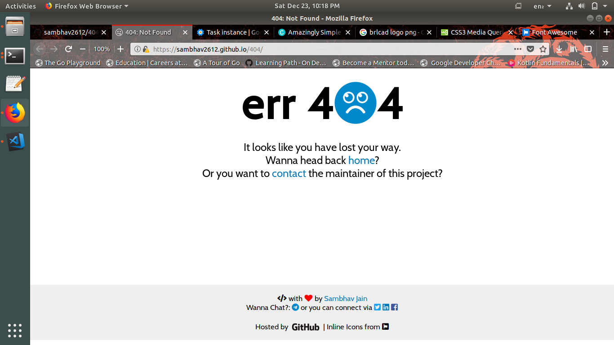

# 404
### A simple 404 webpage written in pure HTML and CSS. Uses Font Awesome's Icon Gallery for Inline Icons.

#### Setup
```bash
$ git clone https://github.com/sambhav2612/404.git
$ cd 404
$ xdg-open index.html 
```

#### Screenshots


